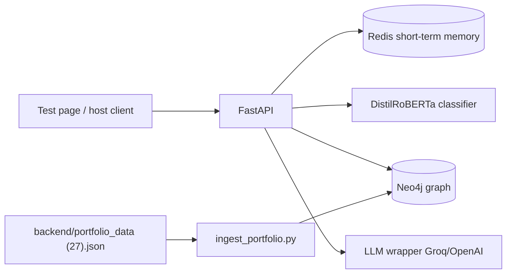
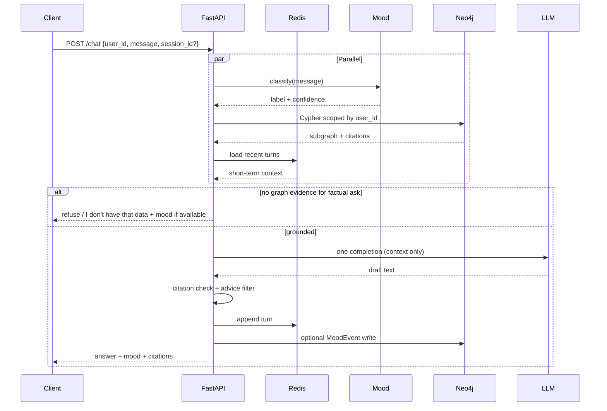

# 02 — Technical Requirements Document (TRD)

**Product:** Portfolio GraphRAG Chatbot (API-first)  
**Status:** Approved  
**Depends on:** `01-PRD.md` (approved)  
**Folder:** `planning/`

---

## 1. Chosen stack & justification

| Layer | Choice | Why |
|-------|--------|-----|
| API | **Python + FastAPI** | Async-friendly, simple OpenAPI docs, easy Docker handoff |
| Graph DB | **Neo4j** (only primary DB) | Multi-hop portfolio + mood; `user_id` as security anchor; one ops surface |
| Session / short-term memory | **Redis** | Stateless API scale; conversation turns keyed by session/`user_id` |
| LLM | **OpenAI SDK** → Groq (`base_url`) now, OpenAI later | Drop-in swap via env; never call SDK outside one wrapper |
| Mood | **DistilRoBERTa emotion** (local/in-process or sidecar) | User emotion from chat text; not FinBERT; LLM never invents mood |
| Orchestration | **None** (hand-rolled Cypher + prompt) | Latency + auditability; single retrieval → single generation |
| Packaging | **Docker Compose** | Reproduce/hand off: one command |
| Test UI | **Minimal static/simple web page** | Exercise API only; not a product UI |
| Observability (v1.1) | Langfuse (optional) | Trace LLM context vs output for groundedness audits |

**Explicitly out of stack:** PostgreSQL, LangChain/LlamaIndex, vector DB (MVP), live market APIs.

---

## 2. Architecture overview



### Request path (chat turn)



### Design principles

1. **Stateless API** — scale horizontally; state in Redis + Neo4j.  
2. **`user_id` is the graph entry node** — every Cypher path starts there.  
3. **LLM = language only** — facts from Neo4j; mood from classifier.  
4. **One retrieval, one LLM call** — no agent loops.  
5. **Ingested snapshot only** — `portfolio_data (27).json` prices are as-of ingest, not live.

---

## 3. Component responsibilities

| Component | Responsibility |
|-----------|----------------|
| `api` | Auth-lite (`user_id` required), rate-limit hooks later, orchestration of parallel mood+retrieve, prompt build, post-filters, response shape |
| `llm_client` | Single OpenAI-compatible wrapper (`LLM_API_KEY`, `LLM_BASE_URL`, `LLM_MODEL`, `max_tokens`) |
| `graph` | Neo4j driver pool, indexed Cypher helpers, citation payloads |
| `mood` | DistilRoBERTa inference + confidence threshold gate |
| `memory` | Redis get/append conversation window |
| `guardrails` | Empty-retrieval refusal; ticker/number ⊆ context check; advisory phrase strip/reject |
| `ingest` | Idempotent load of sample JSON → User/Portfolio/Sector/Holding/Stock |

---

## 4. Data & memory model (summary)

Detail in `05-backend-schema.md`. Intent:

```
(:User {id}) -[:OWNS]-> (:Portfolio {metrics...})
(:Portfolio) -[:HAS_SECTOR]-> (:Sector {...})
(:Portfolio) -[:HOLDS]-> (:Holding {...}) -[:OF]-> (:Stock {ticker, ...})
(:User) -[:HAD_MOOD]-> (:MoodEvent {label, confidence, ts})
```

| Memory | Store | Contents |
|--------|-------|----------|
| Short-term | Redis | Recent chat turns per `session_id` / `user_id` |
| Long-term | Neo4j | Portfolio graph + MoodEvents |

Indexes (required): `User.id`, `Stock.ticker` (and `isin` if used in lookup).

Canonical ingest file: `backend/portfolio_data (27).json`.

---

## 5. Non-functional requirements

### Performance

| Requirement | Target |
|-------------|--------|
| End-to-end chat latency | **&lt; 2s** typical turn |
| Parallelism | Mood + Cypher (+ Redis read) via `asyncio.gather` |
| LLM | Exactly **one** completion; `max_tokens` capped (~300) |
| Retrieval | User-scoped **minimal subgraph** only |
| Connections | Pooled Neo4j + Redis; no per-request driver open |
| Optional (v1.1) | Semantic cache; streaming for perceived speed |

### Scalability (~10k users)

- Scale **API replicas** only (Compose `--scale` / ECS/Fargate/Railway).  
- Neo4j + Redis: single well-sized instances first; replicas/clusters only if measured bottleneck.  
- No sticky sessions required if Redis holds conversation state.

### Security

- Every graph query anchored on `user_id` (no unscoped MATCH).  
- Do not trust client-supplied portfolio facts — only Neo4j.  
- Secrets via env (never commit).  
- Host SSO/JWT out of scope; MVP accepts `user_id` as request field (document as trust-boundary for later hardening).

### Reliability / anti-hallucination

Enforced in layers (see PRD + `reducing hallucinations.md`):

1. Mood from classifier only (+ low-confidence refuse)  
2. Facts from Cypher only (+ empty → refuse)  
3. Citation / source-binding + programmatic entity check  
4. Single-shot generation  
5. Advice/speculation post-filter  
6. Strict system prompt (backstop, not sole control)  
7. Observability later (Langfuse)

### Accessibility

- Test page: usable form + readable responses; WCAG polish not MVP-critical.  
- API: clear error codes/messages for clients.

---

## 6. Third-party services / APIs

| Service | Purpose | Notes |
|---------|---------|-------|
| Groq API | Chat completions | `LLM_BASE_URL=https://api.groq.com/openai/v1` |
| OpenAI (later) | Swap via env | Same wrapper |
| Hugging Face / local weights | DistilRoBERTa emotion | Prefer offline/cached weights in Docker for reproducibility |
| Neo4j | Graph store | Compose service or Aura in prod |
| Redis | Short-term memory | Compose / managed later |

No yfinance, news, or payments in MVP.

---

## 7. Environment strategy

| Env | Purpose | Config |
|-----|---------|--------|
| **dev** | Local Docker Compose | `.env` from `.env.example`; sample ingest; test page |
| **staging** (optional) | Pre-prod parity | Same images; separate Neo4j/Redis; real LLM key |
| **prod** | Deployed API replicas | Managed Neo4j/Redis optional; autoscaled API; no sample-data assumptions |

### Required env vars (MVP)

```
LLM_API_KEY=
LLM_BASE_URL=https://api.groq.com/openai/v1
LLM_MODEL=llama-3.1-8b-instant
NEO4J_URI=bolt://neo4j:7687
NEO4J_USER=neo4j
NEO4J_PASSWORD=
REDIS_URL=redis://redis:6379/0
MOOD_CONFIDENCE_THRESHOLD=0.5
```

*(Exact model id may change; keep via env.)*

---

## 8. Deployment & handoff

**Local / handoff gold path**

1. `cp .env.example .env`  
2. `docker compose up`  
3. `python scripts/ingest_portfolio.py --user-id demo --file "backend/portfolio_data (27).json"`  
4. Open test page → call `/chat`

**Production sketch:** same API image → ECS/Fargate or Railway; Neo4j Aura + managed Redis when ops demand it. Vertical DB first.

---

## 9. Latency budget (guideline)

| Step | Budget (rough) |
|------|----------------|
| Mood classify | concurrent |
| Cypher retrieve | concurrent |
| Redis read | concurrent |
| LLM generate | majority of budget |
| Guardrails | negligible |
| **Total** | **&lt; 2000 ms** |

Do **not** skip citation/guardrails to save time.

---

## 10. Testing strategy (technical)

| Type | Focus |
|------|-------|
| Unit | Cypher builders; citation checker; advice filter; mood threshold gate |
| Integration | Ingest → query by `user_id`; Redis memory round-trip |
| Contract | `/chat` request/response schema |
| Latency smoke | Timed typical question against sample portfolio |
| Negative | Unknown ticker / missing user → refuse, no invented facts |

---

## 11. Open risks / unknowns

| Risk | Mitigation |
|------|------------|
| Mood model cold start blows latency | Warm model at API startup; keep weights in image |
| LLM latency variance | Fast model tier; token cap; optional cache v1.1 |
| Trusting raw `user_id` without host auth | Document as MVP; harden with JWT later |
| Large holdings payload in prompt | Retrieve only question-relevant slice; summarize metrics node |
| Filename with spaces (`portfolio_data (27).json`) | Support path as-is; optional rename later |

---

**Review checkpoint:** Edit this TRD or reply **“TRD approved”** to proceed to `03-UI-UX-schema.md`.
