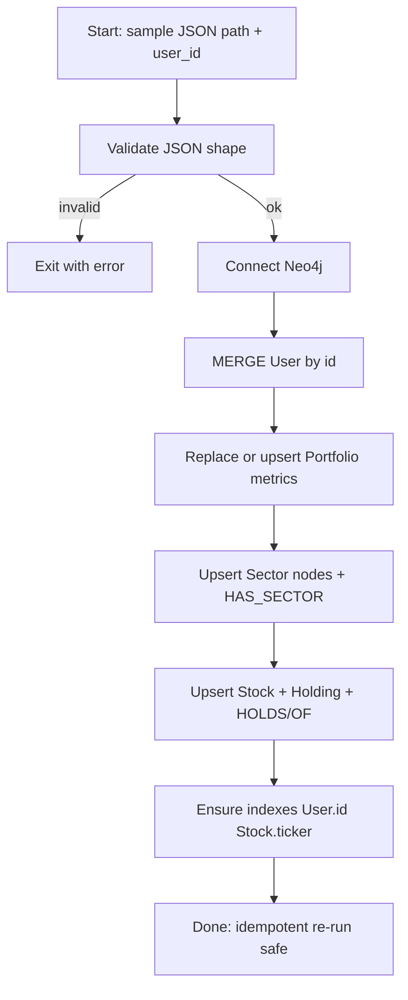
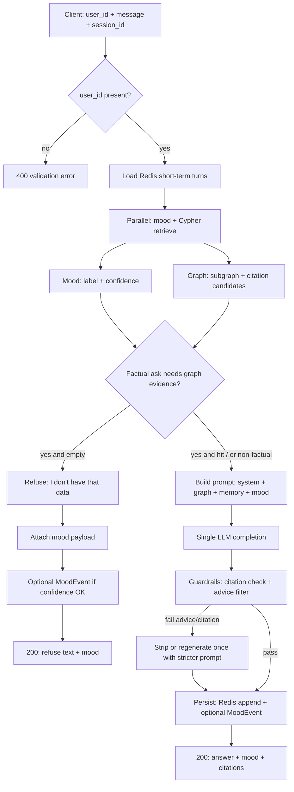
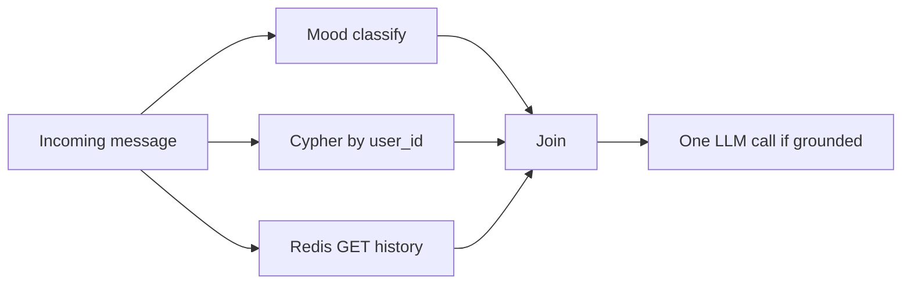
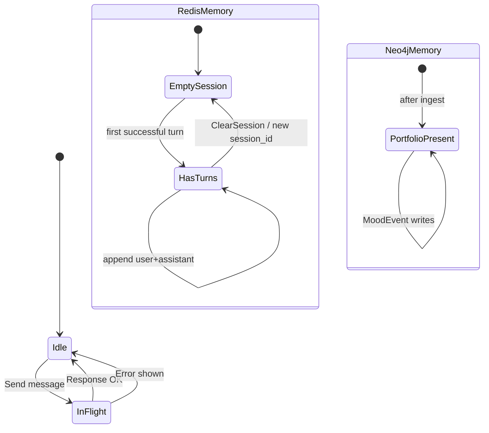
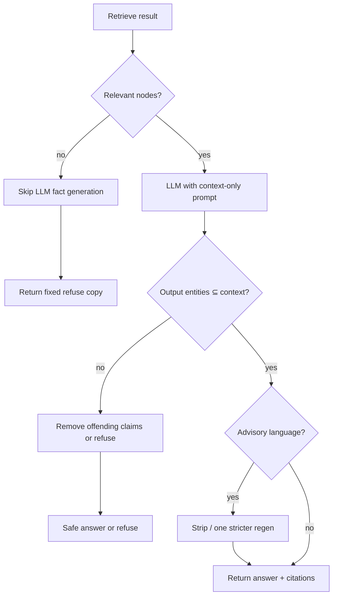

# 04 — App Flow

**Product:** Portfolio GraphRAG Chatbot (API-first)  
**Status:** Approved  
**Depends on:** `01-PRD.md`, `02-TRD.md`, `03-UI-UX-schema.md` (approved)  
**Folder:** `planning/`

---

## 1. Journeys in scope

| Journey | Who | Outcome |
|---------|-----|---------|
| J1 — Ingest sample portfolio | Engineer | JSON → Neo4j under `user_id` |
| J2 — Test chat (happy path) | Tester / integrator | Grounded answer + mood + citations |
| J3 — Multi-turn follow-up | Same user/session | Short-term Redis context used |
| J4 — Refuse / empty data | Any | Honest “no data” — no hallucination |
| J5 — Low mood confidence | Any | Mood gated; facts still answered if grounded |

Host-app login/onboarding is **out of scope**. Entry assumes a known `user_id`.

---

## 2. J1 — Ingest portfolio

**Decision points**

| Point | Behavior |
|-------|----------|
| User missing | `MERGE` create |
| Re-ingest same user | Upsert holdings/sectors/metrics (idempotent) — no duplicate Holding rows for same ticker |
| Partial JSON | Fail fast; do not half-write without transaction |

**Errors**

- File not found / bad JSON → CLI error, no graph write  
- Neo4j down → CLI error  

---

## 3. J2 — Chat turn (primary flow)

### Parallel work (latency)

---

## 4. J3 — Multi-turn (dual memory)

**Rules**

- Changing `session_id` starts empty short-term context; portfolio graph unchanged.  
- Changing `user_id` must not leak prior user’s Redis keys (key by `user_id` + `session_id`).  
- Neo4j never stores full chat transcript in MVP (MoodEvents only + portfolio).

---

## 5. J4 — Anti-hallucination / refuse paths

**Fixed refuse examples (copy)**

- Portfolio fact missing: “I don’t have that data in your portfolio graph.”  
- Mood low confidence: “Not enough signal to read your mood right now.”  
- Never invent tickers, qty, prices, or PnL.

---

## 6. J5 — Mood + facts together

| Mood result | Portfolio result | Response |
|-------------|------------------|----------|
| High confidence | Hit | Answer + mood label + citations |
| Low confidence | Hit | Answer + “not enough signal” + citations |
| High confidence | Miss | Refuse facts + mood label |
| Low confidence | Miss | Refuse facts + “not enough signal” |

Mood never blocks a grounded factual answer. Facts never invent mood.

---

## 7. State transitions (API request)

| State | Meaning |
|-------|---------|
| `validate` | Schema / required fields |
| `load_memory` | Redis read |
| `retrieve_and_mood` | Parallel Cypher + classifier |
| `decide` | Grounded vs refuse |
| `generate` | Single LLM call (optional) |
| `guard` | Citation + advice filters |
| `persist` | Redis write; optional MoodEvent |
| `respond` | JSON to client |

Any step failure after validate → error response; no partial “confident” fake answer.

---

## 8. Edge cases

| Edge | Handling |
|------|----------|
| Unknown `user_id` (no graph) | Refuse all factual asks; mood still runs |
| User exists, ticker not held | Refuse for that entity |
| Ambiguous ticker / nickname | Prefer exact `tradingsymbol` match; if ambiguous ask clarifying question **without** inventing |
| Empty message | 400 |
| Redis down | Proceed without short-term memory; log warning (portfolio still works) |
| Neo4j down | 503 — do not LLM-answer from training knowledge |
| LLM down / timeout | 503 or degrade to structured template from graph only (preferred if cheap) — never free-form invent |
| Advice phrasing slips through | Filter strips or one regen; still no recommendations |
| Session too long | Truncate Redis window to last N turns (e.g. 10) |

---

## 9. End-to-end happy path (narrative)

1. Engineer ingests `backend/portfolio_data (27).json` for `user_id=demo`.  
2. Tester opens test page, sets `user_id=demo`, sends: “How many ADANIPOWER shares do I hold?”  
3. API loads Redis (empty), classifies mood, retrieves Holding/Stock for that user.  
4. LLM phrases answer using retrieved qty/avg only.  
5. Guardrails pass; Redis stores turn; MoodEvent written if confidence OK.  
6. UI shows answer, mood, sources.  
7. Follow-up: “What’s its sector?” uses Redis + new Cypher; still scoped by `user_id`.

---

## 10. Out-of-flow (explicit non-flows)

- Host login → token exchange  
- Live price refresh  
- Buy/sell / recommendation flows  
- Admin UI for ingest  

---

**Review checkpoint:** Edit this doc or reply **“App flow approved”** to proceed to `05-backend-schema.md`.
