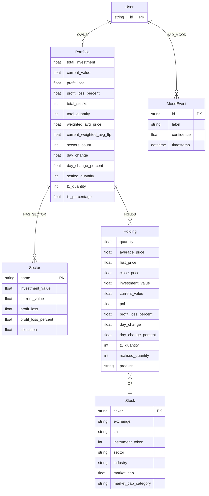

# 05 — Backend Schema

**Product:** Portfolio GraphRAG Chatbot (API-first)  
**Status:** Approved  
**Depends on:** `01`–`04` (approved)  
**Folder:** `planning/`  
**Canonical ingest:** `backend/portfolios/{user_id}_portfolio.json` (each file includes top-level `user_id`)  
**Seed snapshot (for regenerating variants):** `backend/portfolio_data (27).json`

---

## 1. Auth / authorization model (MVP)

| Rule | Detail |
|------|--------|
| Identity | Client sends `user_id` on every request |
| Graph boundary | All Cypher **must** start at `(:User {id: $user_id})` |
| Trust note | Host JWT/SSO is out of scope; treat raw `user_id` as a known MVP trust boundary |
| Authorization | No roles in MVP — possession of `user_id` + ingested graph = access to that subgraph only |
| Secrets | LLM/Neo4j/Redis credentials via env only |

---

## 2. Graph data model (Neo4j)



### Relationships

| Rel | From → To | Notes |
|-----|-----------|--------|
| `OWNS` | User → Portfolio | One portfolio per user in MVP |
| `HAS_SECTOR` | Portfolio → Sector | Sector name unique per portfolio |
| `HOLDS` | Portfolio → Holding | Position properties live on Holding |
| `OF` | Holding → Stock | Stock shared by ticker globally OK; access still via User path |
| `HAD_MOOD` | User → MoodEvent | Append-only mood history |

### Indexes / constraints

```cypher
CREATE CONSTRAINT user_id IF NOT EXISTS FOR (u:User) REQUIRE u.id IS UNIQUE;
CREATE CONSTRAINT stock_ticker IF NOT EXISTS FOR (s:Stock) REQUIRE s.ticker IS UNIQUE;
CREATE INDEX stock_isin IF NOT EXISTS FOR (s:Stock) ON (s.isin);
CREATE INDEX mood_ts IF NOT EXISTS FOR (m:MoodEvent) ON (m.timestamp);
```

### Security Cypher pattern (mandatory)

```cypher
MATCH (u:User {id: $user_id})-[:OWNS]->(p:Portfolio)
// ... further MATCH only from u or p
```

Never: `MATCH (s:Stock {ticker: $t})` without a path from `$user_id`.

---

## 3. JSON → graph mapping

Source: `backend/portfolio_data (27).json`

| JSON path | Graph target |
|-----------|--------------|
| (request) `user_id` | `(:User {id})` |
| `metrics.*` | `(:Portfolio)` properties |
| `sectors[].sector` | `(:Sector {name})` + metrics on node / `HAS_SECTOR` |
| `holdings[].tradingsymbol` | `(:Stock {ticker})` |
| `holdings[].exchange, isin, instrument_token, sector, industry, market_cap, market_cap_category` | Stock props |
| `holdings[].quantity, average_price, last_price, …` | `(:Holding)` props |
| — | `(:MoodEvent)` created at chat time, not from JSON |

**Ingest rules**

- Idempotent: `MERGE` User/Stock; upsert Portfolio; replace or merge holdings by `(user_id, ticker)`.  
- Snapshot prices are ingested as-is (not live).  
- Optional JSON fields (`mtf`, momentum filters, etc.) may be omitted in MVP.

---

## 4. Redis short-term memory

| Key | Value | TTL |
|-----|-------|-----|
| `chat:{user_id}:{session_id}` | JSON list of `{role, content, ts}` | e.g. 24h or sliding |

**Rules**

- Cap last **N** turns (default 10).  
- Clear on new `session_id` or client ClearSession.  
- Does not store portfolio facts (those live in Neo4j).

---

## 5. API contract

Base: FastAPI. JSON request/response. OpenAPI auto-generated.

### `GET /health`

```json
{ "status": "ok", "neo4j": true, "redis": true }
```

### `POST /chat`

**Request**

```json
{
  "user_id": "demo",
  "session_id": "550e8400-e29b-41d4-a716-446655440000",
  "message": "How many ADANIPOWER shares do I hold?"
}
```

| Field | Validation |
|-------|------------|
| `user_id` | required, non-empty string, max 128 |
| `session_id` | optional; server may mint UUID if absent |
| `message` | required, non-empty, max 2000 chars |

**Response 200 (grounded)**

```json
{
  "answer": "You hold 1661 shares of ADANIPOWER at an average price of 103.48 (snapshot).",
  "mood": {
    "label": "fear",
    "confidence": 0.72,
    "insufficient_signal": false
  },
  "citations": [
    {
      "type": "Holding",
      "ticker": "ADANIPOWER",
      "fields": ["quantity", "average_price"]
    },
    {
      "type": "Stock",
      "ticker": "ADANIPOWER",
      "fields": ["sector"]
    }
  ],
  "refused": false,
  "session_id": "550e8400-e29b-41d4-a716-446655440000"
}
```

**Response 200 (refuse facts)**

```json
{
  "answer": "I don't have that data in your portfolio graph.",
  "mood": {
    "label": null,
    "confidence": 0.31,
    "insufficient_signal": true
  },
  "citations": [],
  "refused": true,
  "session_id": "…"
}
```

**Errors**

| Code | When |
|------|------|
| 400 | Validation failure |
| 503 | Neo4j unavailable (do not invent); or LLM hard-fail with no safe template |

### `POST /ingest` (optional HTTP; CLI is primary)

MVP primary path: `scripts/ingest_portfolio.py`. Optional admin endpoint later.

**CLI**

```bash
python scripts/ingest_portfolio.py \
  --user-id demo \
  --file "backend/portfolio_data (27).json"
```

---

## 6. Internal retrieval payload (not raw client API)

Passed into the prompt builder only:

```json
{
  "user_id": "demo",
  "portfolio_metrics": { },
  "sectors": [ ],
  "holdings": [ ],
  "matched_tickers": ["ADANIPOWER"],
  "citation_candidates": [ ]
}
```

Empty `holdings` / no match for a factual ask → `refused: true`, skip fact LLM (or LLM only for phrasing refuse + mood — prefer fixed refuse string).

---

## 7. Data validation rules

| Layer | Rules |
|-------|-------|
| API | Pydantic models; strip/reject empty message |
| Ingest | Required top-level `metrics`, `sectors`, `holdings`; each holding needs `tradingsymbol` |
| Mood | If `confidence < MOOD_CONFIDENCE_THRESHOLD` → `insufficient_signal: true`, `label: null` |
| Guardrails | Every numeric/ticker claim ⊆ retrieval; block advisory phrases |
| LLM | `max_tokens` capped; temperature low (e.g. 0–0.3) |

---

## 8. Prompt constraints (contractual)

System prompt must require:

1. Use only provided context  
2. No financial advice / recommendations / predictions  
3. Say you don’t have data when context lacks it  
4. Mood: only rephrase provided label (or insufficient signal)

Post-generation filters are mandatory backstops (see PRD/TRD).

---

**Review:** Reply with edits, or include in final sign-off with `06`.
